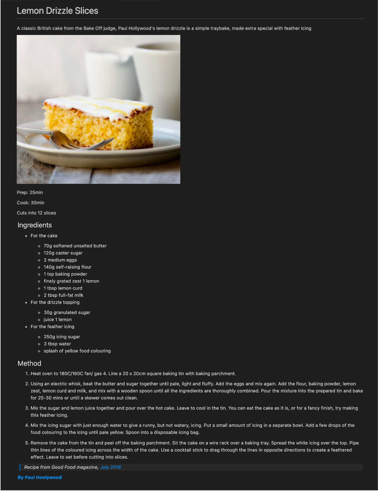

# Mark it Down

## Instructions

* In the [markdown.md file](./markdown.md), you will find placeholder text.
* Add a main heading and then a secondary heading to each paragraph.  
* Make the first three words in the first paragraph bold.
* Make the first three words in the second paragraph italicized.
* Create a list of your favorite foods with a secondary heading.
* Add your favorite quote in a quote format and add a secondary heading as well.

## Output

This is an example output, feel free to add your own text

